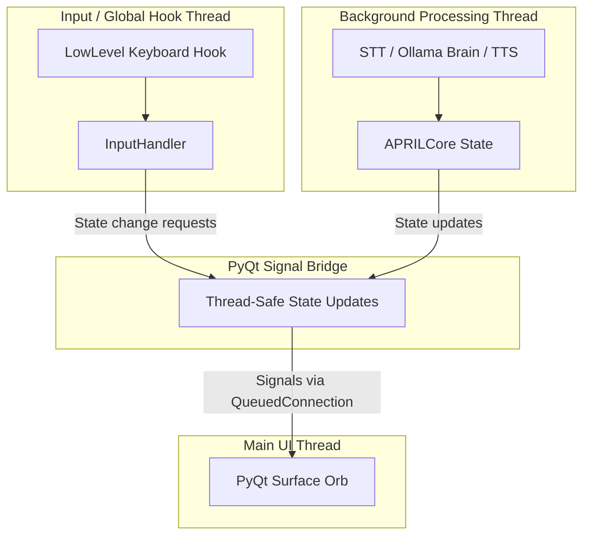

# Architecture Guide — APRIL

This document outlines the internal design, thread boundaries, and data flow of the APRIL assistant.

---

## 1. Thread Boundaries & Message Transport

APRIL splits work across thread boundaries to keep the UI responsive:

1. **Input & Hook Thread:** LowLevel keyboard hooks (`WH_KEYBOARD_LL` via Windows native hooks or `pynput` fallback) capture hotkey actions. Modifiers and timestamps are tracked to filter repeat events.
2. **PyQt Signal Bridge (`APRILBridge`):** Receives state changes from background processing and translates them into thread-safe PyQt signals (`pyqtSignal(str)`). Signals cross into the main thread via Qt's `QueuedConnection` mechanism.
3. **Main UI Thread:** Owns the PyQt surface loop, drawing status updates of the borderless translucent anchor orb.

---

## 2. request_id & job_id Correlation (Causal Chain)

To correlate events across asynchronous execution boundaries, APRIL propagates correlation IDs explicitly:

1. **`request_id` (observability identity):**
   - Born at the interaction boundary (`InputHandler._generate_request_id()`, e.g., `REQ-0001`).
   - Propagated as an explicit parameter through `on_audio`, `handle_user_text`, and down to the bridge state transition triggers.
   - Allows trace events from input, brain routing, and UI repaints to be correlated to a single user interaction.
2. **`job_id` (async task identity):**
   - Generated at async pipeline step transitions (e.g. `STT-0001`, `BRAIN-0001`, `TTS-0001`).
   - Explicitly logged in structured trace events alongside their parent `request_id`.

---

## 3. Authoritative Loops & Snapshot State

Observability projections are unified via the `RuntimeStateSink` protocol:

* **StateAuthority (`APRILCore`):** The single source of truth for the active status (idle, listening, thinking, speaking).
* **State Projections (`state_engine.py`):** Translates event ledger logs into context snapshots (`context_snapshot.json`). Snapshot outputs are injected into LLM prompt prompts to keep the assistant context-aware.
